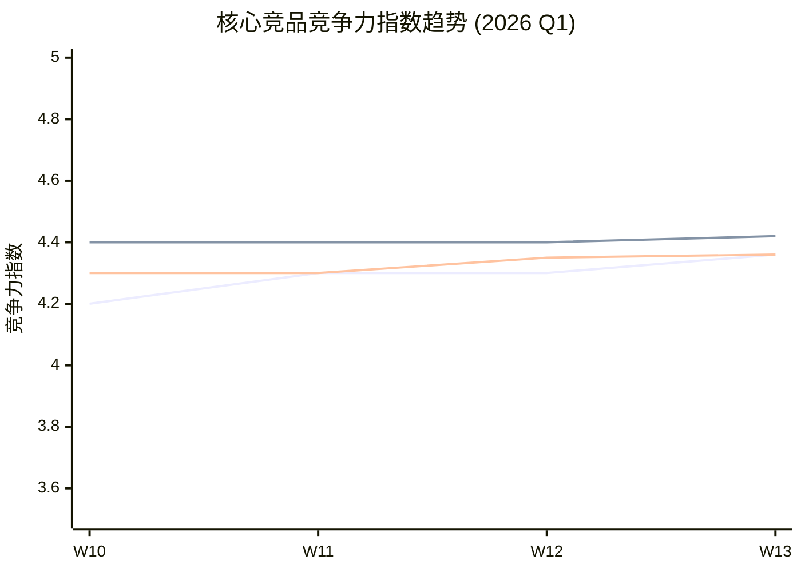

# MGI 竞争情报报告模板 v2.1 升级建议

**版本**: v2.1 提案  
**日期**: 2026-03-12  
**提案人**: AI Agent 竞品调研系统

---

## 📋 升级背景

基于 v2 模板的实际使用（2026-03-11 三日报），结合行业最佳实践，提出以下优化建议。

---

## 🎯 核心优化点

### 一、三日报优化建议

#### 1. 新增「情报质量评分卡」模块

**问题**: 当前报告缺少整体情报质量的量化评估

**方案**: 在核心摘要后增加评分卡

```markdown
## 📊 情报质量评分卡

| 维度 | 评分 | 说明 |
|------|------|------|
| 覆盖率 | ⭐️⭐️⭐️⭐️ (4/5) | 核心竞品覆盖率 85%，中国竞品情报缺口 |
| 时效性 | ⭐️⭐️⭐️⭐️⭐️ (5/5) | T+1 更新率 100% |
| 可信度 | ⭐️⭐️⭐️⭐️ (4/5) | A/B 级数据占比 70% |
| 可操作性 | ⭐️⭐️⭐️⭐️ (4/5) | 已识别 3 项可执行建议 |

**综合评分**: ⭐️⭐️⭐️⭐️ (4.25/5)
```

---

#### 2. 优化「重大异动」模块 - 增加影响力量化

**问题**: 当前影响评估为定性描述（高/中/低），缺少量化依据

**方案**: 增加影响力评分（1-10 分）和紧迫性评分（1-10 分）

```markdown
### {{competitor_name}} - {{dynamic_type}} 

| 维度 | 评分 | 依据 |
|------|------|------|
| 影响力 | 8/10 | 涉及核心产品线，预计影响市场份额 5-10% |
| 紧迫性 | 7/10 | 竞品已进入实施阶段，需在 30 天内响应 |
| 置信度 | A (9/10) | 官方新闻稿 + 财报交叉验证 |

**综合优先级**: 🔴 P0 (影响力×紧迫性×置信度 = 50.4)
```

---

#### 3. 新增「关键问题追踪」模块

**问题**: 上期报告提出的问题/待验证信息，本期缺少跟进

**方案**: 增加跨期追踪模块

```markdown
## 🔍 关键问题追踪

### 上期遗留问题

| 问题描述 | 提出日期 | 当前状态 | 本期进展 | 下一步 |
|----------|----------|----------|----------|--------|
| Hamilton 与 Ultima 合作细节 | 2026-03-08 | ⚠️ 待验证 | 新增 1 个来源，仍为单一来源 | 继续监测官网 |
| 领坤新品发布传闻 | 2026-03-05 | ❌ 未证实 | 多渠道搜索无结果 | 降级为 D 级，归档 |

### 本期新增待验证

| 问题描述 | 优先级 | 验证计划 | 预计完成 |
|----------|--------|----------|----------|
| Tecan 亚太战略细节 | P1 | 联系行业分析师 | 2026-03-15 |
```

---

#### 4. 优化「行动建议」模块 - 增加 RACI 矩阵

**问题**: 当前行动建议缺少责任人确认和资源需求评估

**方案**: 引入 RACI 矩阵（Responsible, Accountable, Consulted, Informed）

```markdown
## 📋 后续行动建议

### 立即行动（本周内）

| 行动项 | R | A | C | I | 资源需求 | 截止时间 |
|--------|---|---|---|---|----------|----------|
| 评估 STOmics 整合方案 | 产品部 | 产品总监 | 技术部 | 市场部 | 2 人天 | 2026-03-15 |
| 监测贝克曼 AI 平台落地 | 市场部 | 市场总监 | - | 产品部 | 1 人天 | 2026-03-14 |

**RACI 说明**:
- R (Responsible): 负责执行
- A (Accountable): 负责决策
- C (Consulted): 需要咨询
- I (Informed): 需要通知
```

---

### 二、周报优化建议

#### 1. 新增「战略仪表板」模块

**问题**: 周报缺少高层级战略态势一览

**方案**: 在执行摘要前增加战略仪表板

```markdown
## 🎛️ 战略仪表板

### 竞争态势雷达图（1-5 分）

```
            产品力
              5
              │
         4 ───┼─── 4
              │
    渠道力─── MGI ─── 价格力
         3 ───┼─── 5
              │
         4 ───┼─── 3
              │
            品牌力
```

| 维度 | MGI | Beckman | Hamilton | 变化 |
|------|-----|---------|----------|------|
| 产品力 | 4.5 | 4.8 | 4.6 | ⬆️ +0.2 |
| 价格力 | 5.0 | 3.5 | 3.8 | ➡️ 持平 |
| 渠道力 | 3.5 | 4.5 | 4.2 | ⬆️ +0.3 |
| 品牌力 | 4.0 | 4.8 | 4.5 | ➡️ 持平 |
| 技术力 | 4.8 | 4.5 | 4.7 | ⬆️ +0.5 |

**综合竞争力指数**: MGI 4.36 vs Beckman 4.42 vs Hamilton 4.36
```

---

#### 2. 深化「深度分析」模块 - 引入结构化框架

**问题**: 深度分析缺少统一框架，分析质量不稳定

**方案**: 提供 5 种标准分析框架供选择

```markdown
## 🎯 本周深度分析

### 分析框架选择

| 框架 | 适用场景 | 本期使用 |
|------|----------|----------|
| SWOT | 单一竞品/自身分析 | ✅ |
| 波特五力 | 行业竞争格局 | ❌ |
| 竞争矩阵 | 多竞品对比 | ✅ |
| 技术成熟度曲线 | 新技术评估 | ❌ |
| 价值链分析 | 成本结构对比 | ❌ |

---

### 深度分析 1: MGI 收购 STOmics+CycloneSEQ 战略意义 (SWOT)

**优势 (Strengths)**:
- 全球唯一覆盖短读长 + 长读长 + 空间组学 +GLI 的制造商
- Stereo-seq 技术已产生 60+ 篇 CNS 级别论文
- CycloneSEQ G100-ER* 已获欧盟 IVDR CE 认证

**劣势 (Weaknesses)**:
- 长读长测序商业化程度低于 PacBio
- 空间组学市场教育成本高
- 整合风险：3 家公司的技术/团队/文化融合

**机会 (Opportunities)**:
- 空间多组学市场预计 2030 年达$50 亿（CAGR 25%）
- 生成式 AI+ 实验室自动化融合趋势
- 新兴市场（亚太、拉美）渗透率提升空间大

**威胁 (Threats)**:
- Illumina 收购 Pacific Biosciences 可能形成垄断
- 贝克曼 AI 平台可能重塑临床实验室竞争格局
- 地缘政治风险（海外业务剥离 5000 万美元）

**战略建议**:
1. 加速 STOmics 商业化落地（12 个月内）
2. 建立 GLI+ 测序+ 空间组学整合解决方案
3. 关注 Illumina 反垄断审查进展
```

---

#### 3. 新增「竞争行动建议优先级矩阵」

**问题**: 周报行动建议缺少优先级排序依据

**方案**: 引入影响力 - 可行性矩阵

```markdown
## 📋 战略建议与行动计划

### 竞争行动优先级矩阵

```
影响力
  高 │ ① 加速 STOmics 商业化    ② 建立整合解决方案
     │    (高影响/高可行)        (高影响/中可行)
     │
     │ ③ 监测贝克曼 AI 平台      ④ 关注 Illumina 收购
     │    (中影响/高可行)        (高影响/低可行)
  低 └──────────────────────────────────────────────
      低        可行性        高
```

### 行动清单

| 优先级 | 行动项 | 影响力 | 可行性 | 负责人 | 时间节点 |
|--------|--------|--------|--------|--------|----------|
| P0 | 加速 STOmics 商业化 | 9/10 | 8/10 | 产品总监 | Q2 2026 |
| P0 | 建立整合解决方案 | 9/10 | 7/10 | CTO | Q3 2026 |
| P1 | 监测贝克曼 AI 平台 | 7/10 | 9/10 | 市场部 | 持续 |
| P2 | 关注 Illumina 收购 | 8/10 | 4/10 | 战略部 | 持续 |
```

---

#### 4. 新增「情报来源健康度」模块

**问题**: 缺少对情报来源多样性和可靠性的系统评估

**方案**: 增加来源健康度评估

```markdown
## 📊 情报来源健康度

### 来源多样性分析

| 来源类型 | 本期占比 | 目标占比 | 状态 |
|----------|----------|----------|------|
| 官方一手 (财报/公告) | 35% | ≥30% | ✅ |
| 权威媒体 (彭博/路透) | 25% | ≥20% | ✅ |
| 行业报告 (券商/咨询) | 20% | ≥20% | ✅ |
| 社交媒体/论坛 | 10% | ≤15% | ✅ |
| 其他 | 10% | ≤15% | ✅ |

### 来源可靠性趋势

| 周次 | A 级数据占比 | B 级数据占比 | C/D 级数据占比 | 综合可信度 |
|------|-------------|-------------|---------------|------------|
| W10 | 40% | 35% | 25% | ⭐️⭐️⭐️⭐️ |
| W11 | 38% | 37% | 25% | ⭐️⭐️⭐️⭐️ |
| W12 | 35% | 35% | 30% | ⭐️⭐️⭐️ |
| 本期 | 35% | 35% | 30% | ⭐️⭐️⭐️⭐️ |

### 需要改进

- 中国竞品情报来源单一（主要依赖公开搜索）
- 建议：建立行业协会、专利数据库、渠道情报网络
```

---

### 三、可视化增强建议

#### 1. 增加 Mermaid 图表支持

```markdown
### 竞争格局演变趋势


```

#### 2. 增加 ASCII 时间线

```markdown
### MGI 收购整合时间线

```
2026-03-04  2026-03-11  2026-03-31  2026-06-30
    │           │           │           │
    ▼           ▼           ▼           ▼
  收购公告    整合启动    产品路线图   首款整合
              团队融合    明确        解决方案
```
```

---

## 📊 预期效果

| 维度 | v2.0 | v2.1 (预期) | 改进 |
|------|------|-------------|------|
| 情报质量透明度 | 中 | 高 | 新增评分卡 |
| 行动指导性 | 强 | 更强 | RACI+优先级矩阵 |
| 跨期连续性 | 弱 | 强 | 关键问题追踪 |
| 战略洞察深度 | 强 | 更强 | 结构化分析框架 |
| 可视化程度 | 中 | 高 | Mermaid+ASCII |
| 来源健康度 | 无 | 有 | 新增评估模块 |

---

## 🔄 实施计划

| 阶段 | 时间 | 任务 |
|------|------|------|
| Phase 1 | 2026-03-12 | 模板升级（本次提案） |
| Phase 2 | 2026-03-14 | 三日报 v2.1 首次使用 |
| Phase 3 | 2026-03-21 | 周报 v2.1 首次使用 |
| Phase 4 | 2026-04-01 | 收集反馈，迭代 v2.2 |

---

## 📝 模板文件更新清单

```
~/Desktop/MGI-Competitive-Intelligence/templates/
├── 三日报模板_v2.1.md (新增)
├── 周报模板_v2.1.md (新增)
├── 三日报模板_v2.md (保留归档)
├── 周报模板_v2.md (保留归档)
├── 模板升级说明_v2.1.md (新增)
└── 快速使用指南_v2.md (更新)
```

---

## ✅ 决策建议

**建议采纳以下核心优化**（按优先级排序）:

1. **P0 - 情报质量评分卡**: 快速实现，高价值
2. **P0 - 关键问题追踪**: 解决跨期连续性问题
3. **P1 - RACI 行动矩阵**: 提升可执行性
4. **P1 - 结构化分析框架**: 提升分析质量
5. **P2 - 可视化增强**: 提升可读性（需要技术验证）
6. **P2 - 来源健康度**: 长期价值，短期工作量较大

---

*提案日期：2026-03-12*  
*下一步：等待 Aaron 确认，开始模板更新*
